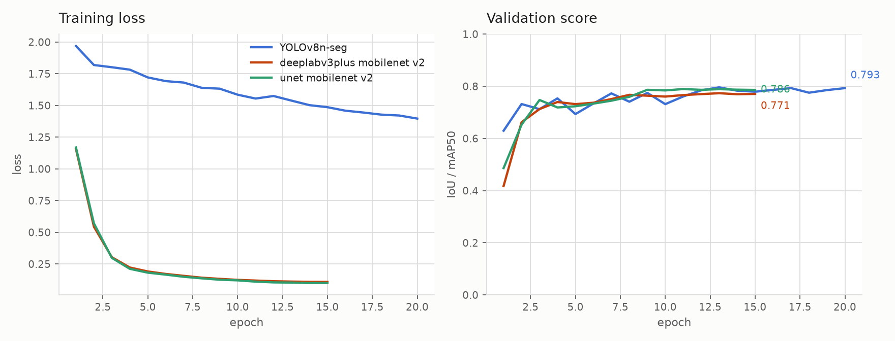

# Low-lying obstacle detection: RGB vs. depth vs. RGB-D

Course project (ITR, CS-8813). Do RGB, depth, and RGB-D differ in how well they detect
small low-lying obstacles on indoor floors (cables, gloves, screws and similar)? A second
question: can masks generated by a foundation model (SAM) replace hand labels for training
a lightweight model?

Background, decisions and the evaluation plan: [`NOTES.md`](NOTES.md).
Bibliography report: [`bibliography_report/`](bibliography_report).

## Dataset

[ISOD](https://www.kaggle.com/datasets/yuchen66/indoor-small-object-dataset) (Chen et al.,
2023, the MOSTS paper). 20 indoor sites, 100 frames each. Per frame: `rgb/`, `depth/`
(16-bit, millimetres), `label/` (hand-drawn, 255 = drivable floor) and `mask/` (the RGB
image with everything the authors' depth ground-plane method judged not-floor blacked out).
Per site: `imu/imu.csv` and `ref.jpg`, a photo of the floor texture.

The dataset is not in this repo (2.5 GB). Fetch it with:

    kaggle datasets download yuchen66/indoor-small-object-dataset -p data --unzip

### Obstacle ground truth

ISOD labels the drivable floor, not the objects, so walls, furniture and the objects are
all "not drivable" alike. `isod.obstacles()` recovers the objects: in the not-drivable
mask, the walls and every piece of furniture touching them form one big connected
component. Dropping it (and blobs under 20 px) leaves the blobs enclosed by floor, which
are the objects lying on the floor. About 8.8 objects per frame.

Known limits: objects touching the wall region are dropped with it; the annotators traced
coiled cables as filled blobs, so cable masks are coarse.

Depth is never used to build the ground truth — only as a method being scored.

## Layout

    code/
      isod.py         paths, splits, ground truth, depth baseline, metrics
      prep_gt.py      writes data/ISOD_gt/, data/splits.json, a contact sheet
      to_yolo.py      exports data/yolo/ (images + polygon labels, one class)
      eval.py         scores any method against the ground truth
      train_yolo.py   fine-tunes yolov8n-seg, writes test masks, reports FPS
      train_seg.py    trains U-Net / DeepLabV3+ on the masks directly
    data/             dataset, derived ground truth, splits (not in the repo)
    explore/          sample sheets for eyeballing the data (not in the repo)
    bibliography_report/   REPORT.md -> REPORT.tex -> PDF, IEEE format

## Running it

    python3 -m venv .venv && .venv/bin/pip install numpy pillow opencv-python-headless

    cd code
    python prep_gt.py          # ground truth + splits + contact sheet
    python eval.py depth test  # depth-only baseline
    python to_yolo.py          # YOLO dataset

On a GPU server (`/opt/venv/jdusza_venv` on shire, see `../GTE_SERVERS.md`):

    CUDA_VISIBLE_DEVICES=0 python train_yolo.py --root /data/cs_courses/jdusza_itr
    CUDA_VISIBLE_DEVICES=0 python train_seg.py --arch unet --encoder mobilenet_v3_large
    CUDA_VISIBLE_DEVICES=0 python train_seg.py --arch deeplabv3plus --encoder mobilenet_v3_large

    python eval.py masks /data/cs_courses/jdusza_itr/pred/yolo test

## Splits

By site, so test rooms are never seen in training: 14 sites train, 3 val, 3 test
(`data/splits.json`).

## Metrics

Obstacle IoU, precision, recall, and the share of objects a method overlaps (detection
rate), plus FPS. Walls and furniture are ignored during scoring: they are labelled
not-drivable but are not our objects, so predicting them is neither rewarded nor punished.

## Metrics

Everything is scored as mask overlap on the obstacle class, over the 300 test images:

- **IoU** — overlap between predicted and true obstacle pixels, divided by their union. The headline number.
- **Precision** — share of predicted obstacle pixels that are real obstacles.
- **Recall** — share of real obstacle pixels that were predicted. For a robot a miss is
  worse than an oversized mask, so recall matters more than precision.

Walls and furniture are ignored: they are labelled not-drivable but are not our objects,
so predicting them neither helps nor hurts. Test sites are never seen during training.

## Results

| Method | Input | IoU | Precision | Recall |
|---|---|---|---|---|
| Ground-plane segmentation (ISOD `mask/`) | depth | 0.031 | 0.132 | 0.039 |
| YOLOv8n-seg | RGB | 0.744 | 0.883 | 0.826 |
| **U-Net (MobileNetV2)** | RGB | **0.776** | 0.906 | 0.844 |
| DeepLabV3+ (MobileNetV2) | RGB | 0.757 | 0.903 | 0.824 |

The depth-only ground-plane method finds almost nothing: these objects are about 3 cm
tall or less, which is below what the plane fit separates from the floor. Every RGB model
lands near 0.75–0.78 IoU, and the three differ far less from each other than any of them
differs from depth. U-Net is slightly ahead of YOLO, which has to go through polygons and
loses accuracy on thin shapes.

Training is cheap: YOLO 20 epochs in about 3 minutes on one RTX 3090, the two semantic
models 15 epochs in about 5 minutes each.

*Per method: green = correct, red = missed, blue = false positive. Depth (column 3) misses
nearly everything; the RGB models catch most objects and disagree mainly on small distant
ones and on reflections.*

## Next

RGB-D fusion (ESANet, or YOLO masks checked against depth), SAM pseudo-labels versus hand
labels, and per-class numbers for cables, gloves and small solid objects.
