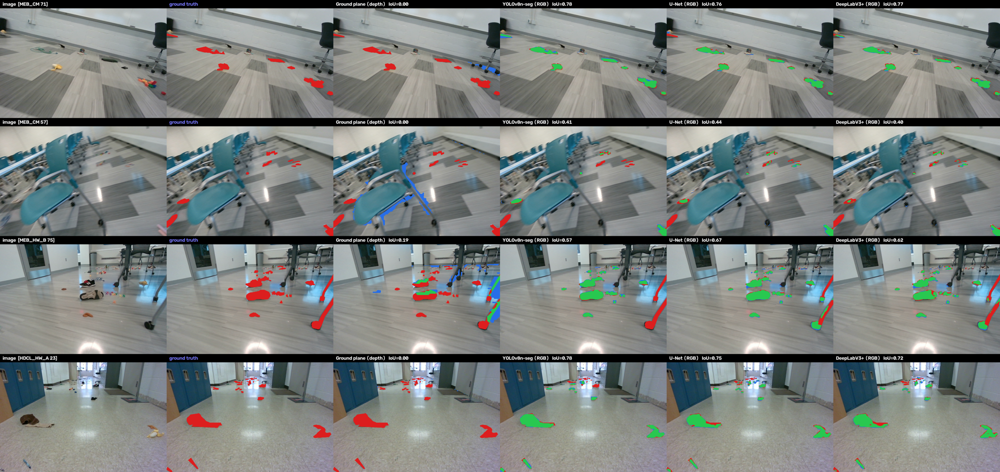
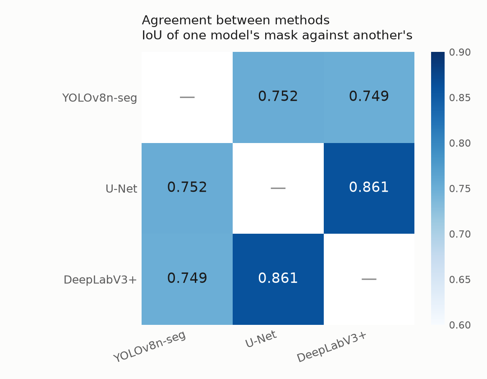
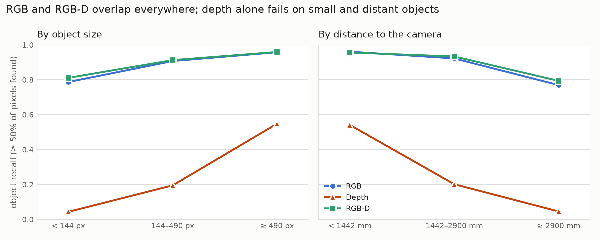
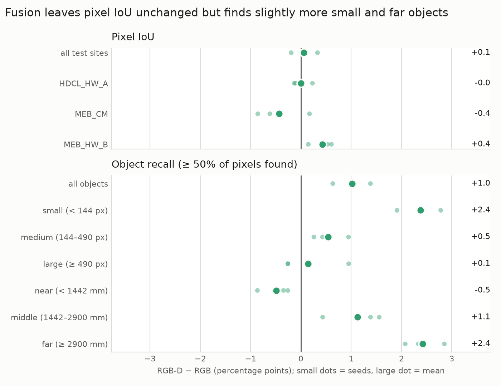

# Low-lying obstacle detection: RGB vs. depth vs. RGB-D

Course project (ITR, CS-8813). Do RGB, depth and RGB-D differ in how well they detect
small low-lying obstacles on indoor floors (cables, gloves, screws and similar)? A second
question is whether masks generated by a foundation model (SAM) can replace hand labels for
training a lightweight model.

Background, decisions and the evaluation plan: [`NOTES.md`](NOTES.md).
Remaining plan: [`ROADMAP.md`](ROADMAP.md).
Bibliography report: [`bibliography_report/`](bibliography_report).

## Dataset

[ISOD](https://www.kaggle.com/datasets/yuchen66/indoor-small-object-dataset)
(Chen et al., 2023, the MOSTS paper). 20 indoor sites, 100 frames each.

Per frame:

- `rgb/`
- `depth/`: 16-bit depth in millimetres, 0 = no reading
- `label/`: hand-drawn, 255 = drivable floor
- `mask/`: RGB image with everything the authors' depth ground-plane method judged
  not-floor blacked out

Per site:

- `imu/imu.csv`
- `ref.jpg`: a photo of the floor texture

The dataset is not stored in this repository (about 2.5 GB). Fetch it with:

```bash
kaggle datasets download yuchen66/indoor-small-object-dataset -p data --unzip
```

### Obstacle ground truth

ISOD labels the drivable floor, not the objects, so walls, furniture and floor obstacles
are all "not drivable". `isod.obstacles()` derives obstacle masks from the hand labels: in
the non-drivable mask, walls and the furniture touching them form one large connected
component. Dropping that component, together with blobs smaller than 20 px, leaves the
objects enclosed by floor, about 8.8 per frame.

Known limitations:

- objects touching the wall region are removed with it;
- coiled cables were annotated as filled blobs, so cable masks are coarse.

Depth is never used to build the ground truth. It is used only as an input to the models
and by the geometric baseline being evaluated.

## Layout

```
code/
  isod.py             paths, splits, ground truth, depth baseline, metrics
  prep_gt.py          writes data/ISOD_gt/, data/splits.json, contact sheet
  to_yolo.py          exports data/yolo/ with polygon labels
  eval.py             evaluates prediction masks against the ground truth
  train_yolo.py       fine-tunes YOLOv8n-seg
  train_seg.py        trains the original RGB U-Net / DeepLabV3+
  train_modal.py      trains the same U-Net on RGB, depth or RGB-D
  run_remaining.sh    runs the 3 inputs x 3 seeds sequentially on one GPU
  summarize.py        evaluates the 9 runs, mean ± std per input
  analyze_objects.py  per-site and per-object analysis
  make_figures.py     regenerates the result figures from the CSVs in results/

results/isod/
  summary.csv           pixel metrics per run
  summary_mean_std.csv  pixel metrics per input, mean ± std over seeds
  site_metrics.csv      pixel metrics per run and test site
  objects_hit_0p5.csv   one row per test object, detected per run (>= 50% of pixels)
  objects_hit_0p25.csv  same with a 25% threshold
  depth_stats.json      depth encoding constants (training sites only)
  checkpoints.sha256    hashes of the 9 checkpoints (not in the repo)
  runs/                 config and training history of each of the 9 runs

figures/
  agreement.png
  methods_comparison.png
  training_curves.png
  object_recall.png
  rgbd_minus_rgb.png

data/                  dataset, derived ground truth and splits (not in repo)
explore/               sample sheets for visual inspection (not in repo)
bibliography_report/   bibliography report
```

## Running it

A light local environment is enough for preprocessing and evaluation:

```bash
python3 -m venv .venv
.venv/bin/pip install numpy pillow opencv-python-headless matplotlib
```

Prepare the ISOD-derived data:

```bash
cd code
python prep_gt.py
python eval.py depth test
python to_yolo.py
```

Training runs on a GPU server (`/opt/venv/jdusza_venv` on shire):

```bash
CUDA_VISIBLE_DEVICES=0 python train_yolo.py --root /data/cs_courses/jdusza_itr
CUDA_VISIBLE_DEVICES=0 python train_seg.py --arch unet --encoder mobilenet_v2
CUDA_VISIBLE_DEVICES=0 python train_seg.py --arch deeplabv3plus --encoder mobilenet_v2
```

Evaluate a prediction directory:

```bash
python eval.py masks /path/to/predictions test
```

The modality experiment has its own section below.

## Splits

The split is by site, so test rooms are never seen during training: 14 train, 3 validation
and 3 test sites, stored in `data/splits.json`.

## Metrics

Everything is scored as mask overlap on the obstacle class over the 300 test images.

- **IoU**: intersection over union between predicted and true obstacle pixels.
- **Precision**: fraction of predicted obstacle pixels that are true obstacle pixels.
- **Recall**: fraction of true obstacle pixels that are predicted.

Walls and furniture are ignored during scoring: they are labelled non-drivable in ISOD but
are not part of the floor-obstacle task. For a mobile robot, recall matters most, because
missing an obstacle is worse than an oversized mask.

## Models

The initial comparison used:

- **YOLOv8n-seg**: instance segmentation, pretrained on COCO.
- **U-Net**: semantic segmentation with skip connections.
- **DeepLabV3+**: semantic segmentation with dilated convolutions and multi-scale context.

The semantic models use a MobileNetV2 encoder pretrained on ImageNet, through
`segmentation_models_pytorch`. The controlled RGB / depth / RGB-D experiment uses the same
U-Net + MobileNetV2 for all three inputs.

## Original model comparison (RGB)

| Method | Input | IoU | Precision | Recall |
|---|---|---|---|---|
| Ground-plane segmentation (ISOD `mask/`) | Depth | 0.031 | 0.132 | 0.039 |
| YOLOv8n-seg | RGB | 0.744 | 0.883 | 0.826 |
| U-Net (MobileNetV2) | RGB | 0.776 | 0.906 | 0.844 |
| DeepLabV3+ (MobileNetV2) | RGB | 0.757 | 0.903 | 0.824 |

All RGB models are far better than the geometric depth baseline. U-Net was selected for
the modality experiment. Its 0.776 comes from a single earlier run without a fixed seed; it
is kept here as a reference and not mixed with the seeded runs below.

Training is cheap on an RTX 3090: a few minutes per semantic model. Longer training did not
help; validation typically plateaued around epochs 12–15.



Green = correct, red = missed, blue = false positive.

### Agreement between RGB methods



Pairwise IoU between predicted masks shows that U-Net and DeepLabV3+ agree with each other
more than with the ground truth. Their errors are correlated: they tend to miss the same
small, distant and thin objects.

## Main experiment: RGB vs. depth vs. RGB-D

The same U-Net + MobileNetV2 was trained with three inputs:

- **RGB**: 3 channels;
- **Depth**: 1 channel;
- **RGB-D**: 4 channels (early fusion).

All runs share the train / validation / test sites, loss, augmentation (horizontal flip),
batch size, learning rate and 15-epoch schedule, use the final-epoch weights, and were
repeated with seeds 0, 1 and 2.

Depth is encoded as clipped inverse depth, `near / d`, standardised with constants computed
on the training sites only (`results/isod/depth_stats.json`: near = 394 mm, far = 7463 mm).
Invalid pixels (0) are mapped to "no return / far", not to "very near". They are rare
(0.1% of obstacle pixels, 0.5% of floor pixels), so no validity-mask channel was added.

For RGB-D, the pretrained RGB filters of the first convolution are kept and the added depth
filter starts at zero. With the same seed, the RGB and RGB-D runs start from identical
weights and see the same batches in the same order. A direct check confirmed that all
comparable tensors are identical at initialisation, so paired differences come from the
depth input (plus non-deterministic GPU kernels).

### Pixel-level results

| Method | Input | IoU | Precision | Recall |
|---|---|---|---|---|
| ISOD ground-plane baseline | Depth | 0.031 | 0.132 | 0.039 |
| U-Net + MobileNetV2 | Depth | 0.390 ± 0.003 | 0.634 ± 0.007 | 0.503 ± 0.008 |
| U-Net + MobileNetV2 | RGB | 0.772 ± 0.001 | 0.903 ± 0.001 | 0.841 ± 0.002 |
| U-Net + MobileNetV2 | RGB-D | 0.772 ± 0.003 | 0.906 ± 0.003 | 0.839 ± 0.002 |

Mean ± sample standard deviation over three seeds.

- The learned depth-only U-Net is far stronger than the geometric baseline (0.390 vs.
  0.031 IoU): the stereo depth carries useful obstacle information.
- Early RGB-D fusion does not change pixel-level segmentation. The paired difference to RGB
  is +0.001 ± 0.003 IoU, and per test site it has no consistent sign:

| Test site | RGB | RGB-D | RGB-D − RGB |
|---|---|---|---|
| HDCL_HW_A | 0.767 ± 0.003 | 0.767 ± 0.004 | −0.000 ± 0.002 |
| MEB_CM | 0.703 ± 0.005 | 0.698 ± 0.006 | −0.004 ± 0.005 |
| MEB_HW_B | 0.818 ± 0.002 | 0.822 ± 0.001 | +0.004 ± 0.002 |

### Object-level analysis

Pixel IoU is dominated by large objects, so each ground-truth object (connected component)
was also scored on its own. An object counts as detected when at least 50% of its pixels
are predicted; the analysis was repeated with 25%.

**Depth adds little complementary information on ISOD.** Of 3,471 test objects, only 15
(0.4%) are detected by depth but missed by RGB (detected = in at least 2 of 3 seeds), and
RGB-D recovers 2 of those 15. Almost everything depth finds, RGB already finds, which
explains why fusion does not change the pooled IoU.

Object recall at the 50% threshold, averaged over seeds:

| Objects | RGB | Depth | RGB-D | RGB-D − RGB (per seed) |
|---|---|---|---|---|
| Small (< 144 px) | 0.787 | 0.043 | 0.811 | +0.024 ± 0.004 |
| Medium (144–490 px) | 0.907 | 0.195 | 0.913 | +0.005 ± 0.004 |
| Large (≥ 490 px) | 0.958 | 0.549 | 0.959 | +0.001 ± 0.007 |
| Near (< 1442 mm) | 0.961 | 0.541 | 0.956 | −0.005 ± 0.003 |
| Middle (1442–2900 mm) | 0.922 | 0.201 | 0.934 | +0.011 ± 0.006 |
| Far (≥ 2900 mm) | 0.770 | 0.045 | 0.794 | +0.024 ± 0.004 |
| All objects | 0.884 | 0.263 | 0.895 | +0.010 ± 0.004 |



Although pixel IoU is unchanged, RGB-D detects slightly more small and distant objects:
the gain is positive in all three seeds for both groups. It loses slightly on near objects,
negative in all three seeds.



Small dots are the three seeds; the large dot is the mean RGB-D − RGB difference.

Depth alone detects only 4–5% of those small and distant objects, so the gain is unlikely
to come from depth seeing the objects directly. Our hypothesis is that the depth channel
provides scene context, such as floor geometry, that helps the RGB features decide which
small or distant pixels stick out from the floor. This mechanism is not tested here
(see Future work).

**Robustness to the hit threshold.** At 25%, only 6 of 3,471 objects (0.2%) are found by
depth and missed by RGB, RGB-D recovers none of them, and RGB-D still detects slightly more
small (0.908 vs. 0.887) and far (0.914 vs. 0.886) objects.

### Reproducing the modality experiment

On shire, inside `tmux`:

```bash
cd code
bash run_remaining.sh <gpu-id>     # 9 runs; skips any run whose .pt already exists
```

A single run:

```bash
CUDA_VISIBLE_DEVICES=0 python train_modal.py --root ~/datasets/isod_work --modality rgbd --seed 0
```

Evaluation and analysis:

```bash
PY=/opt/venv/jdusza_venv/bin/python
$PY summarize.py ~/datasets/isod_work
$PY analyze_objects.py --root ~/datasets/isod_work --hit 0.5
$PY analyze_objects.py --root ~/datasets/isod_work --hit 0.25
```

Copy the small result files from `~/datasets/isod_work/runs/` into `results/isod/`, then
regenerate the figures (no dataset or GPU needed):

```bash
$PY make_figures.py
```

The dataset, checkpoints and prediction masks are not committed. The checkpoint SHA-256
hashes are in `results/isod/checkpoints.sha256`.

## Conclusion on ISOD

1. Learned depth contains far more usable obstacle information than the dataset's geometric
   ground-plane baseline.
2. Early RGB-D fusion does not improve pixel-level obstacle segmentation over RGB alone,
   and depth detects almost no objects that RGB misses.
3. RGB-D shows a small object-level recall gain on small and distant obstacles that is
   consistent across seeds; its cause is not established.

This is not evidence that depth is useless. It is specific to early fusion, to ISOD (where
training and test rooms share the same camera) and to this evaluation protocol.

## Next: robot-camera evaluation

The next experiment tests whether RGB-D is more robust than RGB under a camera / domain
shift. The nine ISOD-trained models stay frozen: no fine-tuning, same threshold, same
`depth_stats.json`.

**Pilot.** One scene, about 10 RGB-D frames, to check that depth is registered to the RGB
image and stored as uint16 millimetres with 0 = invalid, to compare the invalid-depth rate
with ISOD, and to record the camera height and downward tilt.

**Robot dataset.** If the pilot works: 4–6 scenes with different floor textures, 20–30
labelled frames per scene (floor masks, same format as ISOD), high- and low-contrast
obstacles at several distances, and about 10% empty-floor frames.

**Measurements.** Pixel IoU, precision and recall; RGB-D − RGB per seed; the drop from ISOD
to the robot data for each input; object recall by contrast, size and distance; and
whether depth finds objects that RGB misses under the new conditions.

## Future work

Not planned for the main experiment:

- RGB + depth taken from another frame of the same scene, as a control for the
  floor-context hypothesis;
- other RGB-D fusion designs, if the robot data shows that depth finds objects RGB misses;
- SAM pseudo-labels versus hand labels.